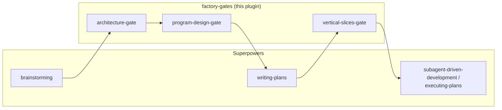

<p align="center">
  
</p>

<h3 align="center">
Human-approved checkpoints for Superpowers' planning flow
</h3>

<p align="center">
  <a href="LICENSE"></a>
  <a href="https://github.com/obra/superpowers"></a>
</p>

---

An add-on plugin for [Superpowers](https://github.com/obra/superpowers) that inserts Dex Horthy's (HumanLayer) 4-gate model — **Product → Architecture → Program Design → Vertical Slices** — as explicit, human-approved checkpoints into the Superpowers planning flow.



This is a non-invasive companion plugin. It does not fork or edit any Superpowers file. It adds three new skills that slot into the gaps between Superpowers' existing skills, plus a `/factory-gates` command for starting a feature with deterministic gate coverage.

## 🧩 Why

Superpowers already gates two of Horthy's four steps well:

| Horthy's Gate | Superpowers today |
|---|---|
| 1. Product | `brainstorming` — covers this well |
| 2. Architecture | Implicit — mixed into `writing-plans`' "File Structure" section, not separately approved |
| 3. Program Design | Missing — no explicit signature/call-stack contract before implementation |
| 4. Vertical Slices | Mostly covered by `writing-plans`' task breakdown + execution handoff, but no explicit sign-off on slice *order* or multi-repo coordination |

This plugin adds:

- **`architecture-gate`** — Gate 2. Component boundaries, data models, cross-cutting constraints. Runs after `brainstorming`, before `writing-plans`.
- **`program-design-gate`** — Gate 3. Types, signatures, call stacks, file layout — a "header file" for the feature, no bodies. Runs after `architecture-gate`, before `writing-plans`.
- **`vertical-slices-gate`** — Gate 4. A short, explicit sign-off on slice order and multi-repo/service sequencing. Runs after `writing-plans` has saved a plan, before `subagent-driven-development` / `executing-plans` starts.
- **`/factory-gates <feature description>`** — an explicit, user-invoked entry point. Starts the workflow with the gate sequence stated up front, rather than relying on `brainstorming`'s own routing to pick it up. See "Known limitation" below for why this exists.

The result: `brainstorming` → `architecture-gate` → `program-design-gate` → `writing-plans` → `vertical-slices-gate` → `subagent-driven-development` / `executing-plans`.

## 📦 Install

Requires Superpowers already installed. From your project (or globally):

```
/plugin marketplace add /path/to/factory-gates
/plugin install factory-gates@factory-gates
```

Or point at a git remote once you've pushed this directory to one:

```
/plugin marketplace add chrschy/factory-gates
/plugin install factory-gates@factory-gates
```

## ⚠️ Known limitation — read this

> [!WARNING]
> Superpowers' own `brainstorming` skill ends with an explicit instruction: *"Invoke the writing-plans skill... Do NOT invoke any other skill."* Because this plugin doesn't edit Superpowers' files, that instruction still exists verbatim. `architecture-gate`'s description is written to be highly specific ("use immediately after brainstorming, before writing-plans") so Claude picks it up as the more specific match — and Superpowers' own `using-superpowers` router skill instructs Claude to invoke *any* applicable skill, not just the one another skill points to. This is a soft override, not a hard one, and this repo measures it empirically (`tests/gate-routing/`) rather than just asserting it works. A bare request can also skip `brainstorming` entirely and jump straight into an unrelated skill (e.g. `test-driven-development`) instead — a more severe pattern than losing only the `architecture-gate` handoff, and one the test harness now detects and classifies as a failure rather than an inconclusive result.

Three ways to make it more reliable, all measured, none of them a hard guarantee — each works by adding an explicit, early statement that `brainstorming`'s hard "invoke writing-plans only" instruction has to compete against, not by editing Superpowers' own files or routing rules:

| Mechanism | How | Measured result |
|---|---|---|
| (bare, no phrasing) | Plain feature request, no workaround | 3 trials (small sample — see note below): 1 fail (skipped `brainstorming` entirely, jumped straight to another skill instead), 2 inconclusive (`brainstorming` fired correctly, then got detoured mid-conversation into an unrelated skill before running out of turn budget) — this is the baseline the mechanisms below improve on |
| Say so explicitly | Start the feature with *"Use the factory-gates workflow for this."* | 22 formal trials, 0 fails; explicit phrasing also correlates with fewer non-completions than a bare request |
| `/factory-gates <description>` | Use the command instead of a plain message | 3 trials, 0 fails, 0 inconclusive |
| `CLAUDE.md` project instruction | Add the snippet below to your project's `CLAUDE.md` once | 3 trials, 0 fails, 0 inconclusive |

> [!NOTE]
> The bare-scenario sample above is intentionally small: verifying the test harness's own classification logic (see `tests/gate-routing/`) surfaced and fixed several real bugs in it, and confirming the fix consumed the available trial quota for this round. Expanding this sample is tracked as a follow-up.

> [!TIP]
> Add this to your project's `CLAUDE.md` once, and you won't need to remember any of the above per feature:

```markdown
## Software Factory Workflow
For any new feature or creative work, use the factory-gates workflow — architecture-gate and program-design-gate run before writing-plans, vertical-slices-gate runs before execution. Do not skip these gates even if a skill's own instructions say to invoke writing-plans directly.
```

## 🔗 Superpowers compatibility

Verified against Superpowers **6.2.0 – 6.3.0**. There's no dependency-version mechanism in the Claude Code plugin format to declare this formally — `plugin.json` has no `dependencies` field, checked directly against every plugin manifest in this environment's local marketplace cache, including Superpowers' own. This is a documented, empirically-tracked stance, not a mechanically enforced one.

The coupling is narrow but real: factory-gates' routing strategy (see "Known limitation" above) depends on specific wording in Superpowers' own skills, not any formal API —
- `brainstorming`'s hard "invoke writing-plans... do NOT invoke any other skill" instruction
- `using-superpowers`'s "if a skill applies, you MUST use it" routing rule

If a future Superpowers release changes that wording materially, factory-gates' soft-override strategy could degrade silently — there is no automated check outside of actually running the test suites.

`tests/gate-routing/lib/common.sh` prints a warning to stderr if the installed Superpowers version falls outside the verified range (older: a real warning; newer: a softer note, since untested doesn't mean broken) every time a test suite resolves the Superpowers plugin directory. If you see one, or if you've just updated Superpowers and something in the factory-gates workflow feels off, re-run `tests/gate-routing/run-all.sh` — that's exactly the empirical check this exists for.

## 🙏 Credits

- 4-gate model: Dex Horthy, HumanLayer — as described in his "Harness Engineering is not Enough: Why Software Factories Fail" talk and various podcast appearances (2026).
- Base framework this plugs into: [obra/superpowers](https://github.com/obra/superpowers) (Jesse Vincent).

This is an unofficial community glue layer, not affiliated with HumanLayer or the Superpowers project.
