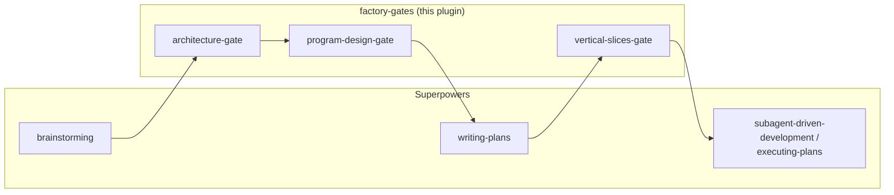

# factory-gates — README Redesign

**Status:** approved
**Date:** 2026-08-15

## Why

The README's content is accurate and complete (gate table, install steps, real measured determinism data, credits) but plainly formatted — no visual orientation for a first-time reader beyond prose. Redesign the presentation only, using [charmbracelet/vhs](https://github.com/charmbracelet/vhs) and [rbtsbg/emp-exp](https://github.com/rbtsbg/emp-exp) as style references, without changing what it says.

## What was borrowed from each reference, and why

Neither reference maps directly — VHS's README leans on GIF demos (no equivalent for a skills plugin with no visual terminal output) and emp-exp's leans on academic directory-tree/config-file documentation (not applicable here). What transfers:

- **From VHS:** a badges row under the title, a big visual "orient the reader in 2 seconds" element right after the tagline (VHS uses a demo GIF; here, a Mermaid flowchart of the gate pipeline — GitHub renders Mermaid natively, so it costs nothing extra), and GitHub's `> [!WARNING]` / `> [!TIP]` alert callout syntax for the "Known limitation" section instead of plain bold text.
- **From emp-exp:** light emoji markers before section headers for quick visual scanning — used sparingly (top-level `##` headers only, not every subsection) per the explicit "not too verbose or overloaded" brief, unlike emp-exp's own every-header usage.

## Badges

Only real, currently-true facts — no build-status or version badge, since there's no CI or cut release yet to back them:

- MIT license (real — `LICENSE` file exists)
- "Requires Superpowers" (accurate, informative, links to the dependency)

## The Mermaid diagram

Visualizes the plugin's core pitch directly — which pieces are Superpowers' own vs. this plugin's addition:



## Full new `README.md` content

```markdown
# factory-gates

<p>
  <a href="LICENSE"></a>
  <a href="https://github.com/obra/superpowers"></a>
</p>

An add-on plugin for [Superpowers](https://github.com/obra/superpowers) that inserts Dex Horthy's (HumanLayer) 4-gate model — **Product → Architecture → Program Design → Vertical Slices** — as explicit, human-approved checkpoints into the Superpowers planning flow.


This is a non-invasive companion plugin. It does not fork or edit any Superpowers file. It adds three new skills that slot into the gaps between Superpowers' existing skills, plus a `/factory-gates` command for starting a feature with deterministic gate coverage.

## 🧩 Why

Superpowers already gates two of Horthy's four steps well:

| Horthy's Gate | Superpowers today |
|---|---|
| 1. Product | `brainstorming` — covers this well |
| 2. Architecture | Implicit — mixed into `writing-plans`' "File Structure" section, not separately approved |
| 3. Program Design | Missing — no explicit signature/call-stack contract before implementation |
| 4. Vertical Slices | Mostly covered by `writing-plans`' task breakdown + execution handoff, but no explicit sign-off on slice *order* or multi-repo coordination |

This plugin adds:

- **`architecture-gate`** — Gate 2. Component boundaries, data models, cross-cutting constraints. Runs after `brainstorming`, before `writing-plans`.
- **`program-design-gate`** — Gate 3. Types, signatures, call stacks, file layout — a "header file" for the feature, no bodies. Runs after `architecture-gate`, before `writing-plans`.
- **`vertical-slices-gate`** — Gate 4. A short, explicit sign-off on slice order and multi-repo/service sequencing. Runs after `writing-plans` has saved a plan, before `subagent-driven-development` / `executing-plans` starts.
- **`/factory-gates <feature description>`** — an explicit, user-invoked entry point. Starts the workflow with the gate sequence stated up front, rather than relying on `brainstorming`'s own routing to pick it up. See "Known limitation" below for why this exists.

The result: `brainstorming` → `architecture-gate` → `program-design-gate` → `writing-plans` → `vertical-slices-gate` → `subagent-driven-development` / `executing-plans`.

## 📦 Install

Requires Superpowers already installed. From your project (or globally):

```
/plugin marketplace add /path/to/factory-gates
/plugin install factory-gates@factory-gates-dev
```

Or point at a git remote once you've pushed this directory to one:

```
/plugin marketplace add <your-org>/factory-gates
/plugin install factory-gates@factory-gates-dev
```

## ⚠️ Known limitation — read this

> [!WARNING]
> Superpowers' own `brainstorming` skill ends with an explicit instruction: *"Invoke the writing-plans skill... Do NOT invoke any other skill."* Because this plugin doesn't edit Superpowers' files, that instruction still exists verbatim. `architecture-gate`'s description is written to be highly specific ("use immediately after brainstorming, before writing-plans") so Claude picks it up as the more specific match — and Superpowers' own `using-superpowers` router skill instructs Claude to invoke *any* applicable skill, not just the one another skill points to. This is a soft override, not a hard one, and this repo measures it empirically (`tests/gate-routing/`) rather than just asserting it works.

Three ways to make it more reliable, all measured, none of them a hard guarantee — each works by adding an explicit, early statement that `brainstorming`'s hard "invoke writing-plans only" instruction has to compete against, not by editing Superpowers' own files or routing rules:

| Mechanism | How | Measured result |
|---|---|---|
| Say so explicitly | Start the feature with *"Use the factory-gates workflow for this."* | 16 formal trials, 0 fails; explicit phrasing also correlates with fewer non-completions than a bare request |
| `/factory-gates <description>` | Use the command instead of a plain message | 3 trials: 2 pass, 0 fail, 1 inconclusive (the model got stuck on an unrelated clarifying question before reaching the routing decision — not a routing failure) |
| `CLAUDE.md` project instruction | Add the snippet below to your project's `CLAUDE.md` once | 3 trials: 2 pass, 0 fail, 1 inconclusive (same as above — no fails in either new mechanism) |

> [!TIP]
> Add this to your project's `CLAUDE.md` once, and you won't need to remember any of the above per feature:

```markdown
## Software Factory Workflow
For any new feature or creative work, use the factory-gates workflow — architecture-gate and program-design-gate run before writing-plans, vertical-slices-gate runs before execution. Do not skip these gates even if a skill's own instructions say to invoke writing-plans directly.
```

## 🙏 Credits

- 4-gate model: Dex Horthy, HumanLayer — as described in his "Harness Engineering is not Enough: Why Software Factories Fail" talk and various podcast appearances (2026).
- Base framework this plugs into: [obra/superpowers](https://github.com/obra/superpowers) (Jesse Vincent).

This is an unofficial community glue layer, not affiliated with HumanLayer or the Superpowers project.
```

## Self-review

- **Placeholders:** none — the full replacement content is final, concrete text.
- **Internal consistency:** all factual content (gate table, install commands, the 3-mechanism determinism table, CLAUDE.md snippet, credits) is carried over unchanged from the current README — this is a presentation-only pass, not a content rewrite. Verified by direct comparison against the current file before drafting.
- **Scope:** one file, presentation only. No changes to any skill, test, or other documentation.
- **Ambiguity:** none — every design choice (which badges, why no build/version badge, why a Mermaid diagram instead of a GIF, why sparing emoji use) has a stated reason, not left implicit.
